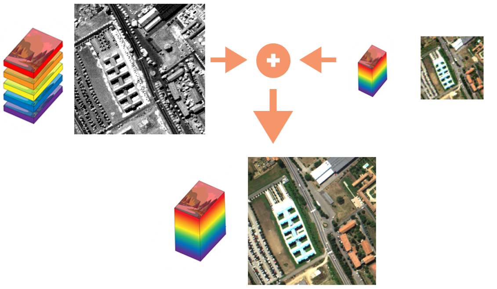
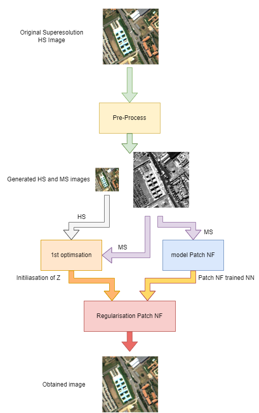

# Patch-Based Neural Network Regularization for Hyperspectral Image Fusion

  
   
  <em>Figure 1: Simplified schema of the fusion process. <a href="https://www.edmundoptics.com/knowledge-center/application-notes/imaging/hyperspectral-and-multispectral-imaging/">Adapted from source: Edmund Optics on Hyperspectral and Multispectral Imaging</a></em>

## Overview
This repository contains code for the implementation of a neural network-based approach for fusing hyperspectral images, utilizing patch-based regularization techniques, called Patch-NF. The project aims to enhance feature extraction and improve classification performance by effectively combining information from multiple hyperspectral datasets.

## Datasets
The code is tailored for the following hyperspectral datasets:
- **Indian Pines**: This scene captured by AVIRIS sensor over the Indian Pines test site in North-western Indiana and consists of a mix of agricultural and forested areas.
- **Pavia University**: Captured by the ROSIS sensor during a flight campaign over Pavia, northern Italy, this dataset primarily covers urban areas.

## Getting Started
### Prerequisites
- Python 3.x
- PyTorch
- NumPy
- Additional Python libraries as required (see `requirements.txt` for a complete list)

### Installation
1. Clone the repository:
git clone https://github.com/AfonsoSCCarvalho/Patch_NF.git
2. Navigate to the cloned repository:
cd Patch_NN
3. Install the necessary Python packages:
pip install -r requirements.txt

 
<em>Figure 2: Schema used in the Patch NF procedure.</em>

### Running Patch-NF
A simplified schema of the procedure used in this thesis is presented in Figure 2. Starting with the original super-resolution HS image, we performed a pre-processing step that generated the simulated hyperspectral and multispectral images. This step allowed us to obtain a good initialization of Z for our Patch NF regularization through an initial optimization. Although the DEEP SURE solution provides even better results, the FUSE solution was chosen as the most optimal for this process.

The multispectral image was also used to train our Patch Normalizing Flow neural network. After training, the Patch NF algorithm was employed, which, after a certain number of steps, produced the final image. This resulting image was then compared with other baseline results to evaluate its performance.

To run the scripts for image fusion:
1. Execute on of the main scripts:
python PatchNN_clean_fuse.py
python PatchNN_clean_deep_sure.py

## Contact
If you have any questions or would like to contribute to the project, please feel free to contact me.

## License
This project is licensed under the MIT License - see the LICENSE file for details.

